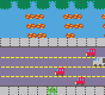

Sapper
======

Sapper is a LIKO-12 game disk that recreates an old friendly game.

Programming and sprites by: Ciro Duran <ciro.duran@gmail.com>

Requires LIKO-12_V0.7.1_PRE, freely available in
https://ramilego4game.itch.io/liko12.

Sapper is written in Lua, with game data in the LIKO-12 format. You can
inspect the file with a text editor, but it's better to open it directly
inside LIKO-12.

